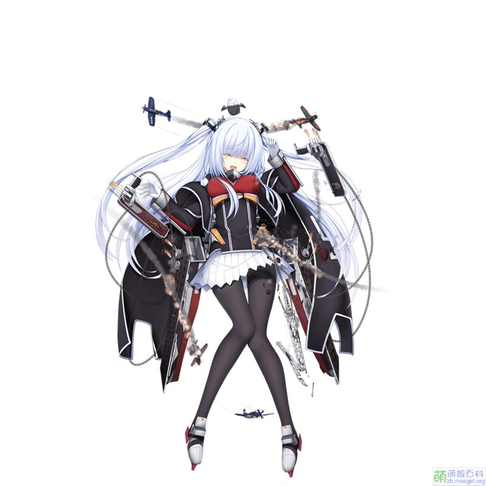

title: 戦艦の女の子 の 航母 - 诶塞克斯
tags:
  - 埃塞克斯
  - 航母
categories:
  - 戦艦の女の子
date: 2016-03-03 13:49:03
---

## 战舰少女
首先让我们认识一下这个游戏的名字：
> 戦艦の女の子 【せんかんのおんなのこ】【senkannoonnanoko】

## 航空母舰
还有航空母舰这个单词
> 航空母艦日【こうくうぼかん】【koukuubokann】  

> 航空母舰。（航空機を搭載し、これを発着させるための飛行甲板および格納庫・修理設備などを備えた軍艦。今日、水上兵力の中核。略称、空母。）

## 埃塞克斯
下面进入正题，就是我很喜欢但是还咩有得到的 - 埃塞克斯

## 建造公式

1. 标准航母公式：400,600,600,400（基本上赌航母都用这个）
2. 低费航母公式：300,30,400,300（当资源不足时可用）
3. 常用玄学公式：400 600 650 430（目前出货率极高的公式）
4. 500 130 600 400（据说出货率更高~）

## 建造时间
4 个小时
